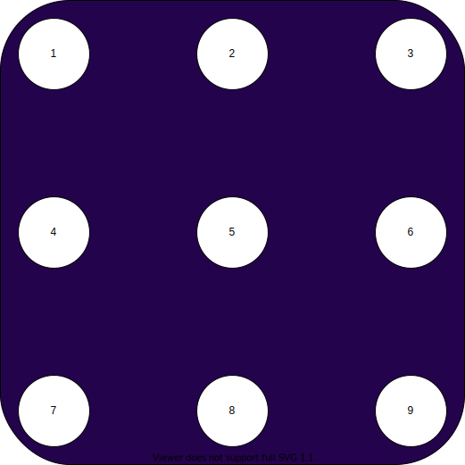

# rota_ai

This repository is a project to make a rules based ai for the [rota game](https://www.niconico.ca/en/produit/rota/#slide-1).

To simplify the code, the disposition of the board will be as :

